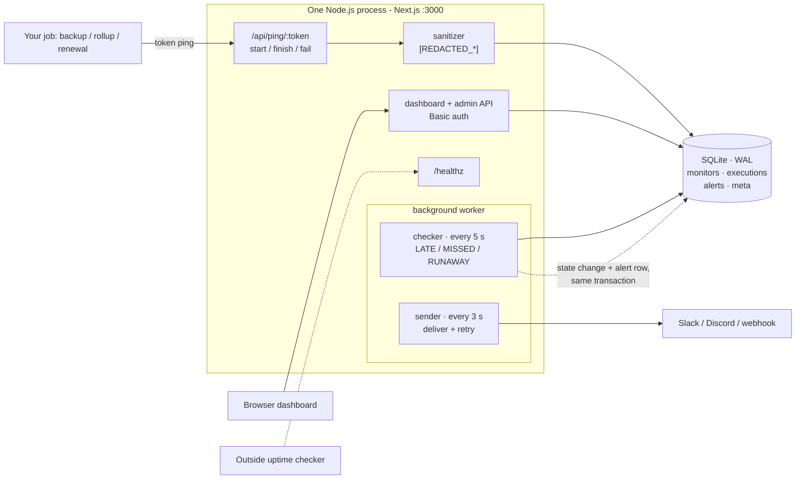

# SkanSentinel

SkanSentinel is a monitoring and alerting system for scheduled background jobs.

For example, imagine a company has a backup job:

- Every night at 2:00 AM → Database backup runs
- Normally, nobody watches this job manually.

If the job crashes because of a database timeout, a server or memory problem, a broken file path, a network issue, or a worker failure, the job may simply stop without anyone knowing.

SkanSentinel's job is to detect that failure and immediately alert the developers.

## The problem

Scheduled jobs fail in the worst way: quietly. A normal bug in your app throws an error, and errors get caught by regular monitoring. A job that never runs produces *nothing* — no error, no log line, no alert. A backup that crashed at 2 AM looks exactly like a backup that wasn't needed. Both cases: silence.

So teams find out days later, when a restore fails or a report comes up empty, and by then the problem is ancient history. Normal monitoring watches things that happen. Nobody watches things that **should** have happened but didn't. That gap is what SkanSentinel fills.

## How it works

```
[Your cron job] ──ping──► [SkanSentinel server] ──stores──► [SQLite database] ◄──reads── [Dashboard in browser]
                                   │
                                   └──alert──► [Slack / Discord / webhook]
```

Four players, one loop:

1. **Your job** (a cron script) sends a "started / finished / failed" ping to SkanSentinel.
2. **The SkanSentinel server** stores every ping in **SQLite** and keeps a timer running.
3. **The dashboard** reads that same database — so what you see is exactly what the server knows.
4. If a ping is missing or a run fails, the server doesn't wait for the dashboard — it pushes an **alert** to Slack, Discord, or a webhook on its own.

Each job gets a monitor with two things: a secret ping token and a known cron schedule. The job sends SkanSentinel a "started / finished / failed" message when it runs. SkanSentinel knows the schedule, so it always knows when the next message is due:

- If the expected message doesn't arrive in time (due time + a grace period), the job is marked **MISSED**.
- If the job runs too long (past its max runtime), it is marked **RUNAWAY**.
- If the job reports a failed exit code, it is marked **FAILED**.

Any of these immediately alerts the team on Slack, Discord, or a generic webhook. The alert includes the error log with secrets like passwords and API keys removed. The next successful run sends a "recovered" notice so everyone knows the job is back.

Two details make this trustworthy. Detection runs on a timer inside the server, not in the browser — it works with every laptop closed. And each failure produces exactly **one** alert, so a job crash-looping for a week doesn't bury your Slack channel.

## Features

- **Monitors.** One watched job each: name, cron schedule, timezone (defaults to IST), grace minutes, max runtime minutes, and an alert channel. The server generates a secret 64-character ping token per monitor.
- **Ping API.** The job calls `.../start` when it begins and `.../finish` or `.../fail` when it ends. Simple jobs can just hit the bare ping URL once per run. These are the only public endpoints, rate-limited to 60 requests/minute and capped at 256 KB bodies.
- **Server-side detection.** A checker runs every 5 seconds and an alert sender every 3 seconds, inside the server. MISSED and RUNAWAY stick until the job itself reports back.
- **Alert channels.** Slack, Discord, generic webhook, or dashboard-only. The webhook message carries the monitor name, what went wrong, the exit code, and the last 20 log lines. Failed deliveries are retried automatically.
- **Secret redaction.** Before any log is stored or sent, passwords, API keys, tokens, private keys, JWTs, and credentials inside URLs are replaced with `[REDACTED_...]` markers — so an alert can never leak a secret into Slack.
- **Dashboard.** Status cards, a monitor table refreshing every 3 seconds, pause/resume/delete actions, and a red banner if the background worker itself stops reporting.
- **Detail page per monitor.** Average / median / P95 run durations, a duration chart, run history showing how late each run started, and copy-paste snippets for curl, Bash, Python, and Node.js.
- **`skansentinel-exec` helper.** A tiny shell script that wraps any command: sends start, runs the job, sends finish/fail with the real exit code and the job's output, and exits with the job's own code. If SkanSentinel is unreachable, the job runs anyway — monitoring can never break what it monitors.

## Tech stack

| Area | Details |
|------|---------|
| Runtime | Next.js 16 (App Router, TypeScript) as one long-lived Node.js server — deliberately not serverless, because the background worker needs a living process |
| Database | SQLite via `better-sqlite3` — one file, write-ahead logging, foreign keys. Zero database services to run. |
| Scheduling | `cron-parser` for the schedule math, `cronstrue` to show cron in plain English ("At 02:00 AM") |
| UI | Tailwind CSS v4, system fonts, lucide-react icons |
| Auth | HTTP Basic auth in middleware, constant-time comparison |
| Tests | Vitest — 54 unit tests, all passing |

## Architecture



## Getting started

Prerequisites: Node.js 22+, npm, Git.

```powershell
git clone https://github.com/VineshF1/SkanSentinel
cd SkanSentinel
npm install
Copy-Item .env.example .env
```

Open `.env` and set `ADMIN_PASSWORD` to a long random secret — the server refuses to start without one. `DATABASE_PATH` already points at `./data/production.db`, and the folder is created automatically on first boot.

| Variable | Required | What it does |
|---|---|---|
| `ADMIN_PASSWORD` | Yes | Password for the dashboard login and every admin API. Compared in constant time; failed attempts are slowed down. |
| `DATABASE_PATH` | No | SQLite file path. Default `./data/skansentinel.db`. Use `./data/production.db` locally, a mounted volume path in Docker. |
| `ALLOW_PRIVATE_WEBHOOKS` | No | `1` allows `http://`/localhost webhooks for local testing. Keep `0` in production: only `https` URLs to public addresses are accepted, checked at save time and again at send time. |

Then build and run:

```powershell
npm run build
npm run start -- -p 3000
```

(or `npm run dev` while developing). Open http://localhost:3000 and log in with your `ADMIN_PASSWORD` — any username works.

With Docker:

```powershell
docker build -t skansentinel .
docker run -p 3000:3000 `
  -e ADMIN_PASSWORD='pick-a-strong-password' `
  -v skansentinel-data:/app/data `
  skansentinel
```

The `-v` mount keeps the SQLite file alive across container restarts — without it, every redeploy wipes all monitors and history.

## Try it: the failure-detection demo in two minutes

There's no public demo URL, but the two-minute version to run locally is the real pitch:

1. Dashboard → **New monitor** → set cron to `* * * * *` (every minute). The form previews the next runs in plain English as you type.
2. Copy the **Ping URL** from its Details page.
3. Wrap a job with the helper — `./skansentinel-exec http://localhost:3000 <TOKEN> -- ./your-job.sh` — or just curl `/start` before the work and `/finish` after.
4. Watch the row move PENDING → RUNNING → HEALTHY.
5. Now **stop the job** and do nothing else. Within a couple of minutes the server notices the missing ping and flips the monitor to MISSED — and the alert fires — all by itself. The next successful run sends RECOVERED.

That silent flip from HEALTHY to MISSED, with no browser open, is the whole product.

Run the tests with `npm test` (54 tests, all passing).

## Project structure

```text
SkanSentinel/
├── skansentinel-exec            # shell wrapper: start → run → finish/fail, exits with the job's code
├── Dockerfile / .dockerignore
├── src/
│   ├── middleware.ts            # Basic auth for everything except ping / healthz / exec
│   ├── instrumentation.ts       # starts the worker once, Node runtime only
│   ├── app/
│   │   ├── page.tsx             # dashboard — summary cards, live table, new-monitor form
│   │   ├── monitors/[id]/page.tsx # stats, snippets, chart, history, log viewer, alert channel
│   │   ├── healthz/route.ts     # {"ok":true} for external uptime checks
│   │   ├── skansentinel-exec/route.ts # helper download (public)
│   │   └── api/
│   │       ├── ping/[token]/    # start / finish / fail + bare-token heartbeat
│   │       ├── monitors/        # CRUD + pause / resume / channel / test-alert
│   │       ├── alerts/route.ts  # recent alerts feed
│   │       ├── status/route.ts  # dashboard snapshot + worker_online
│   │       └── cron-preview/route.ts # plain English + next 3 times while you type
│   └── lib/
│       ├── time.ts              # one epoch-seconds helper used everywhere
│       ├── db.ts                # schema, WAL / FK / busy-timeout, 200-run prune
│       ├── engine.ts            # start / finish / fail / heartbeat transitions
│       ├── worker.ts            # checker (5 s) + sender (3 s) loops
│       ├── schedule.ts          # cron next-run, drift, grace windows
│       ├── sanitizer.ts         # 7 ordered redaction rules, 64 KB cap, never throws
│       ├── alerts.ts            # channels, retry/backoff, payload bodies
│       ├── monitors.ts          # validation, token gen, SSRF check at save
│       └── auth.ts              # constant-time compare
├── tests/unit.test.ts           # 54 tests
└── .env.example
```

## Known limitations

- Runs as **one** server process with persistent disk (VPS, Render, Railway, Fly.io). It will not work on serverless hosts like Vercel — the worker needs a living process.
- Login is HTTP Basic: put it behind HTTPS and choose a strong `ADMIN_PASSWORD`.
- Webhook hosts are checked at save time and send time; a DNS change in between is not covered.
- If the server dies, monitoring stops with it; point an outside uptime checker at `/healthz`.
- `docker build` and native shell execution of `skansentinel-exec` were verified at the HTTP layer only on the Windows build host — run both on Linux/macOS to confirm end to end.
- The default timezone is IST (`Asia/Kolkata`); any valid IANA timezone still works per monitor.


